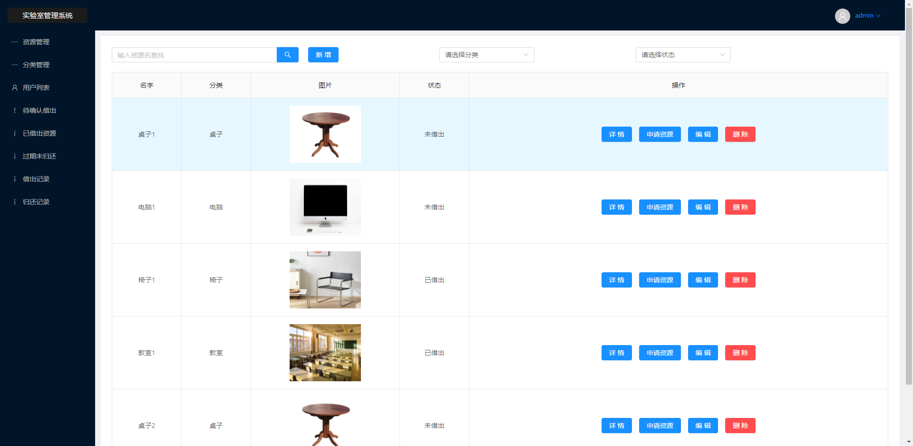
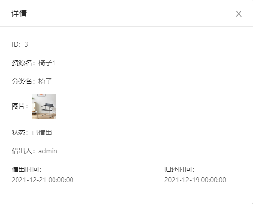
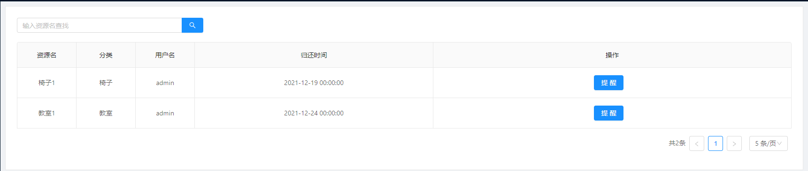
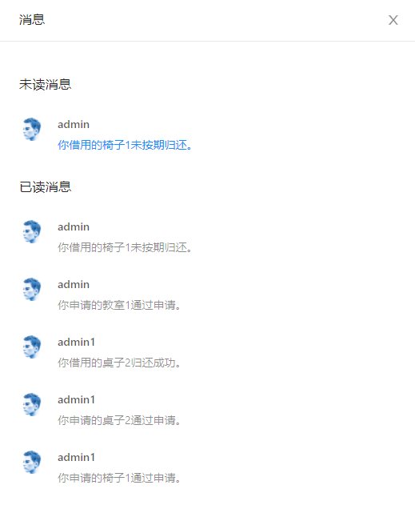
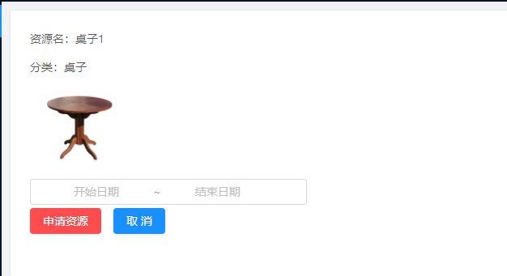
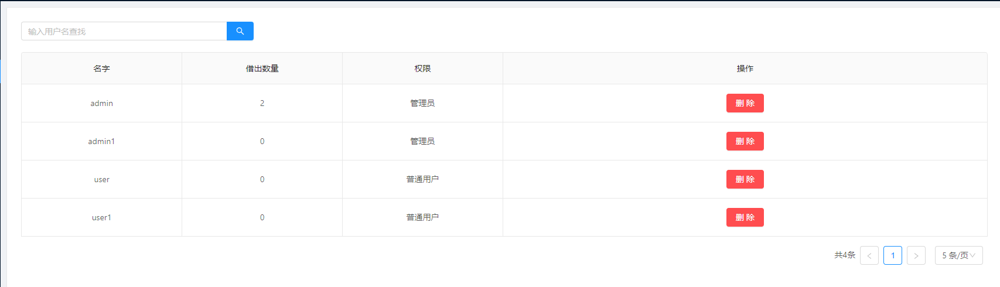

# 实验室资源管理系统

##需求
实验室管理系统要满足一下需求：第一，管理人员通过计算机管理各类资源，进行资源的分类、添加、删除。第二，管理员对资源的借出和归还进行管理。

##技术栈

Vue+Gin+Mysql

##如何运行

###建表 
Mysql数据库执行

`create table borrow_record
(
id int auto_increment
primary key,
rid int not null,
cid int not null,
uid int not null,
mid int not null,
time datetime not null,
constraint borrow_record_id_uindex
unique (id)
);`

或

导入database的admin.sql文件

###配置文件

修改config.ini文件

DbUser ：数据库用户名

DbPassWord ：数据库密码

[yun] 中的是上传七牛云功能的参数，不使用的话不填写也不影响其他功能运行

###运行指令
在admin目录终端下输入

`go build`

`./admin`

##部分功能展示
###已实现的功能
用户登录及注册

资源的添加、删除、编辑、查找以及资源的借用、审批、归还。

向未按期归还资源发送提醒消息。

未读消息提示，补充消耗型资源提示，待审批资源提示。

资源的操作记录（添加时间、借出时间、归还时间等）和消息记录。
###登录界面

###资源管理界面

###资源详情界面

###提醒超期未归还功能界面

###提示消息界面

###申请资源界面

###用户管理界面

